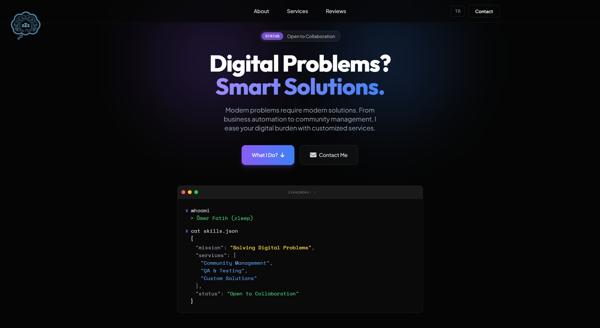

# zleep.dev

**zleep.dev** is a modern, responsive, and bilingual (TR/EN) personal landing page and portfolio website designed for a **Growth Strategy, QA & Community Management** professional.



## 🚀 Features

-   **Bilingual Support (TR/EN):** Seamless language switching with persistent preference storage (LocalStorage).
-   **Modern UI/UX:** Built with "Glassmorphism" aesthetics, smooth gradients, and micro-interactions.
-   **Responsive Design:** Fully optimized for all devices (Mobile, Tablet, Desktop).
-   **Infinite Carousel:** Custom-built, touch-enabled infinite loop carousel for testimonials.
-   **Performance Focused:** Minimal dependencies, optimized assets, and clean code.
-   **Agent SEO Ready:** Optimized for AI with `llms.txt` and JSON-LD Schema Markup.
-   **Analytics:** Integrated Google Analytics 4 (GA4) with secure configuration.
-   **Cookie Consent:** GDPR-compliant cookie consent banner with multi-language support.
-   **Legal Compliance:** Dedicated Privacy Policy and Terms of Service pages.

## 🛠️ Tech Stack

-   **Structure:** HTML5 (Semantic)
-   **Styling:** [Tailwind CSS](https://tailwindcss.com/) (via CDN) + Custom CSS (`assets/css/style.css`)
-   **Scripting:** Vanilla JavaScript (ES6+) (`assets/js/main.js`)
-   **Icons:** [Font Awesome 6](https://fontawesome.com/)
-   **Fonts:** 'Outfit', 'Plus Jakarta Sans', and 'Space Mono' via Google Fonts.

## 📂 Project Structure

```bash
zleepdev/
├── index.html          # Main landing page
├── contact.html        # Contact page
├── privacy.html        # Privacy Policy
├── terms.html          # Terms of Service
├── llms.txt            # AI Agent Context
├── robots.txt          # Crawler directives
├── sitemap.xml         # Site map
├── assets/
│   ├── css/
│   │   └── style.css   # Custom styles & animations
│   ├── js/
│   │   ├── main.js         # Logic for language, carousel, etc.
│   │   ├── analytics.js    # GA4 loader script
│   │   └── config.js       # Configuration file (GA4 ID)
│   └── img/
│       ├── logo_transparent.png
│       ├── favicon.png
│       └── testimonials/       # Client/Streamer avatars
└── README.md
```

## 🌟 Recent Work Showcase
The site now includes a dedicated "Recent Work" section showcasing key projects:
- **ABI Builder**: A visual database for Arena Breakout weapon builds.
- **ABI Randomizer**: A random loadout generator for the same game.


## 🔒 License

&copy; 2026 **zleep.dev**. All Rights Reserved.
Design and code are proprietary.

## 📬 Contact

-   **Website:** [zleep.dev](https://zleep.dev)
-   **GitHub:** [github.com/imzleep](https://github.com/imzleep)
-   **Email:** [contact@zleep.dev](mailto:contact@zleep.dev)
-   **Discord:** zleep
